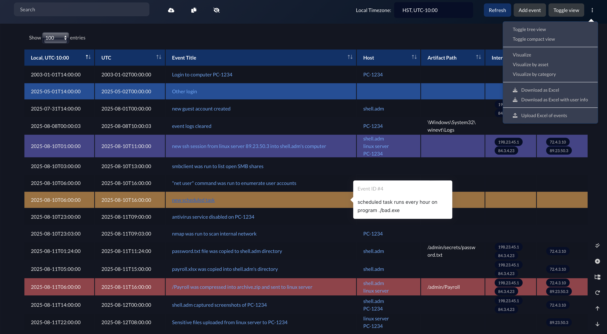
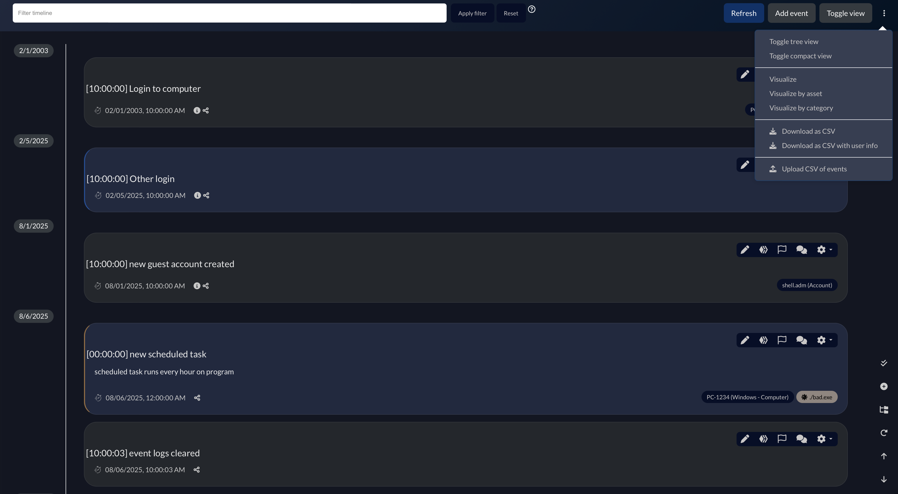

<p align="center">
    
</p>

<p align="center">
  Incident Response Investigation System
  <br>
  <i>Current Version v2.4.20</i>
  <br>
  This is a fork by FBI Cyber, where several features are customized for the FBI's power users. Most notable changes are in the Timeline feature. 

</p>

# IRIS

[](./LICENSE.txt)   
Iris is a web collaborative platform aiming to help incident responders sharing technical details during investigations.  
The codebase is up-to-date with the official release tag of Iris v2.4.20, with the addition of FBI Cyber's customizations. The codebase is currently aligned with the official releases of DFIR-Iris only.


## Differences between FBI Cyber's Iris and DFIR-Iris
Most of the key changes are in the Timeline, where the events are displayed in a tabular format.  
This format aligns with FBI Cyber's forensic process and better facilitates investigative workflows. Having the events displayed in this format allows the investigators to more efficiently capture the notable events.

| FBI Cyber Iris              | DFIR-Iris                    | 
|:---------------------------:|:----------------------------:|
|   || 


### Highlights of the changes offered in this fork:
- Events in Timeline are displayed in a table, providing a more holistic view for investigators.
- Simpler search bar in the Timeline that automatically displays rows containing searched keywords, alleviating the burden to have to learn additional filtering syntax.
- Timeline has Excel import and export available, in addition to CSV.
- New Local Timezone dropdown on Timeline page to allow user to select the appropriate local time and calculate the UTC and Local timestamps more accurately.
- Local browser cache of graph nodes to enable graph persistence between sessions. Graph nodes stay in the same position that user places them in, after page refresh or switching tabs.

For a more detailed list of changes, please visit [`CHANGELOG.md`](CHANGELOG.md).

## Running Iris
This set of instructions is unique to FBI Cyber's Iris. To see DFIR-Iris's build instructions, visit this GitHub [site](https://github.com/dfir-iris/iris-web).

```
# Get the latest Iris source code
git clone https://github.com/fbicyber/iris-web.git 
cd iris-web
git checkout release

# Make a .env file in the root directory — iris_web/.env, and change the appropriate secret key(s) and passwords in .env
cp .env.model .env

# Make sure the following variables are set/changed: 
- POSTGRES_PASSWORD
- POSTGRES_ADMIN_PASSWORD
- IRIS_ADM_PASSWORD
- IRIS_ADM_EMAIL
- IRIS_ADM_USERNAME

# Start up all the containers until they're healthy
docker compose build --no-cache
docker compose up -d
```

Verify that Iris UI is accessible at `https://<your_instance_ip>/login`. Log in with username from `IRIS_ADM_USERNAME` and password from `IRIS_ADM_PASSWORD`.


## DFIR-Iris
To view the official Iris documentation for the upstream version, visit this GitHub [site](https://github.com/dfir-iris/iris-web).